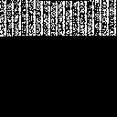

# data2pixel


`data2pixel` is a simple command-line utility for encoding arbitrary binary data into a black-and-white PNG image and decoding it back again. The tool treats a lossless PNG as a 2‑D bitfield (one bit per pixel) and maps each byte of input to eight horizontal pixels.

## Features

- **Simple workflow**: encode any file to a portable PNG, then decode it later.
- **Self‑describing format**: a small header embeds a magic value and original data length, preventing accidental misinterpretation of random images.
- **Predictable growth**: images always have square dimensions that are powers of two (32×32, 64×64, 128×128, …). Capacity is `(N * N) / 8` bytes.
- **Robust decoding**: thresholds non‑perfect black/white pixels and validates the header.
- **Pure Python**: depends only on `numpy` and `Pillow`.

## Requirements

- Python 3.8+ (tested on Linux/macOS/Windows)
- `numpy`
- `Pillow`

Install dependencies via pip:

```sh
pip install numpy pillow
```

## Usage

```sh
python3 datapixel.py --encode --in <input-file.txt> --out <output.png>
python3 datapixel.py --decode --in <input.png> --out <restored-file.txt>
```

### Example

```sh
# encode a text file
python3 datapixel.py --encode --in message.txt --out message.png

# later decode it back
python3 datapixel.py --decode --in message.png --out recovered.txt

# or without output file directly to stdout
python3 datapixel.py --decode --in message.png
```

> **Note:** The PNG must remain lossless and unmodified. Any image operation that alters pixel values (resizing, JPEG conversion, dithering, optimization tools, etc.) will corrupt the embedded data.

## How it works

- The payload begins with a 12‑byte header: the ASCII signature `"DPX1"` and a 64‑bit little‑endian length of the original data.
- Bytes are packed into a square image whose side length is the next power of two sufficient to store `bits = (header + data) * 8`.
- Each byte is stored LSB‑first across eight horizontal pixels using 0 for black and 255 for white.
- Decoding reverses the process, thresholds pixel values (>127 as 1) and validates the header to extract exactly the original bytes.

## Limitations

- The image width is always a multiple of eight (eight pixels per byte).
- No compression is performed beyond PNG's built-in lossless compression.
- Designed for small-to-moderate files; very large payloads will produce very large images.

## Examples

### 2 Byte
`X` will be encoded to 

### 614 Byte

```text
Lorem Ipsum is simply dummy text of the printing and typesetting industry.
Lorem Ipsum has been the industry's standard dummy text ever since the 1500s,
when an unknown printer took a galley of type and scrambled it to make a type specimen book.
It has survived not only five centuries, but also the leap into electronic typesetting,
remaining essentially unchanged. It was popularised in the 1960s with the release of Letraset
sheets containing Lorem Ipsum passages, and more recently with desktop publishing software
like Aldus PageMaker including versions of Lorem Ipsum.
(Created with: https://www.lipsum.com/)
```

will be encoded to 




## License

This project is provided "as is" under the [MIT License](LICENSE).

## Contact

For questions or issues, open an issue in the repository or contact the author.